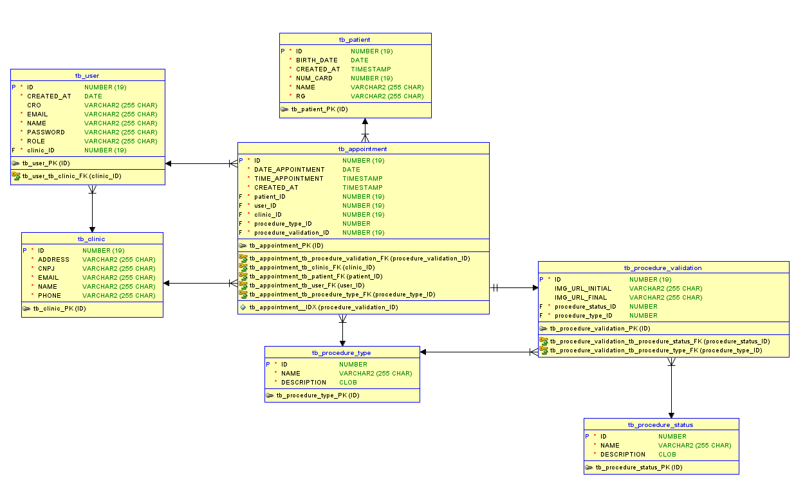

# Odonto Validation

Serviço de Validação de Consultas Odontológicas

### Link p/ apresentação da solução: https://www.youtube.com/watch?v=wJah-rw1eGQ&ab_channel=Kau%C3%A3Silveira

## Integrantes do Grupo

### Kauã Almeida Silveira
- **Responsável por:** API em Java Spring Boot, integração com o banco de dados Oracle, e API Python com Roboflow para visão computacional.
### Rafael Vida
- **Responsável por:** DevOps no Azure e QA, garantindo o pipeline de integração contínua e a qualidade do software.
### Gustavo Maia
- **Responsável por:** Desenvolvimento do App em Kotlin para Android e site em C#.

## Instruções para Rodar a Aplicação

## Pré-requisitos para rodar a API Spring Boot:
- Java 17 ou superior instalado (para a API Spring Boot)
- Maven instalado (para a API Spring Boot)
- As configurações do banco de dados Oracle estão no arquivo `application.properties` na pasta `src/main/resources`,
  não é necessário instalar o banco de dados Oracle, pois a aplicação está utilizando um banco de dados disponibilizado
  em um servidor remoto da FIAP.

## Passo a Passo:

1. **Clone o repositório:**
   ```git clone https://github.com/ChallengeOdontoPrev/javaAdvanced.git```
2. **Acesse a pasta do projeto no intellij:**
   ```javaAdvanced/odontoprev```
3. **Defina o JDK no Intellij para Run & build do projeto**
4. **Rode a aplicação Spring Boot, localizada na pasta raiz**
   ```OdontoPrevApplication.java```

## Como testar a API Spring Boot:

1. **Importe o arquivo de coleção do Postman:**
   ```ChallengeOdontoPrev.postman_collection.json```
2. **Importe o arquivo de ambiente do Postman:**
   ```Auth.postman_environment.json```
3. **Execute as requisições do Postman para testar a API**

Observação: Vale ressaltar que a API Spring Boot está utilizando
Spring Security com JWT para autenticação e autorização. Logo, é necessário
realizar o login para obter o token JWT e inseri-lo no Authorization das requisições como bearer token.

## Endpoints da API Spring Boot:

### Autenticação (`/auth`)
- **POST** `/auth/login`
- **POST** `/auth/signup`
- **POST** `/auth/forgot-password`
- **POST** `/auth/reset-password`

### Clínicas (`/clinics`)
- **GET** `/clinics`
- **POST** `/clinics`

### Pacientes (`/patients`)
- **GET** `/patients`
- **POST** `/patients`

### Consultas (`/appointments`)
- **POST** `/appointments`

## Diagrama de Entidade-Relacionamento (DER)


